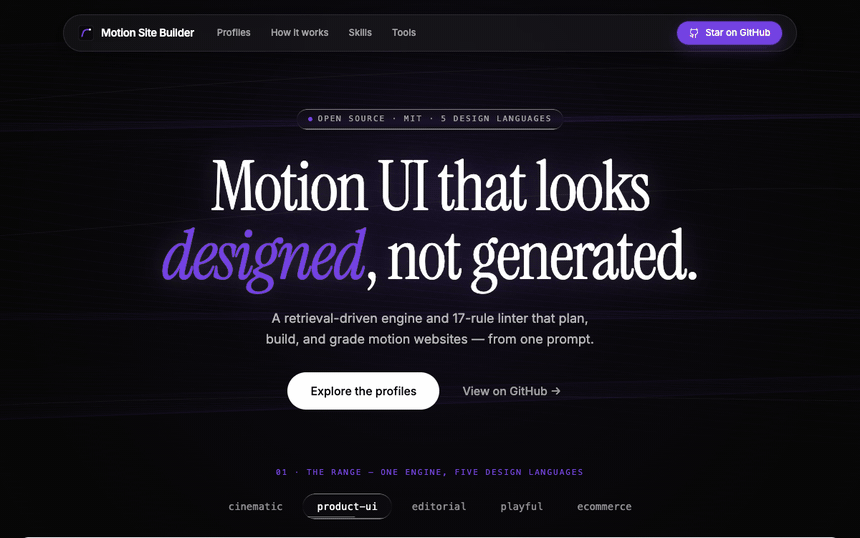

<div align="center">


# Motion Site Builder

**Design, review, and improve motion-driven interfaces with AI.**

Generate new sites or refine existing UI through profile-aware building, strict motion review, whole-codebase audits, executable improvement plans, and a deterministic 17-rule linter.

[](https://github.com/olbboy/motion-site-builder/actions/workflows/ci.yml)
[](https://github.com/olbboy/motion-site-builder/releases/latest)
[](LICENSE)
[](prompts/README.md)
[](skills/motion-site-builder/scripts/lint_motion.py)
[](https://github.com/olbboy/motion-site-builder/stargazers)
[](CONTRIBUTING.md)

[**Live demo**](https://olbboy.github.io/motion-site-builder/) · [Quick Start](#-quick-start) · [How It Works](#-how-it-works) · [The Design DNA](#-the-design-dna) · [Docs](#-documentation) · [Contributing](#-contributing)

[](https://olbboy.github.io/motion-site-builder/)

*This [landing page](https://olbboy.github.io/motion-site-builder/) ([`site/`](site)) was built from [its own prompt](prompts/motion-site-builder-landing.md) — a cinematic shell whose hero embeds a live five-language stage — and scores 100/A+ on every file with the bundled motion linter.*

</div>

---

## What You Can Do

| Job | Start with | Outcome |
|---|---|---|
| **Build new UI** | A brand brief, page idea, or existing reference prompt | Working React/Vite/Tailwind code or a portable one-shot prompt |
| **Review a change** | A diff or motion-bearing component | Profile-aware findings, exact Before/After values, and a **Block/Approve** verdict |
| **Improve an existing app** | A codebase that feels sluggish, generic, or inconsistent | Prioritized audit → self-contained plans → optional `execute` → reviewed implementation |
| **Validate and tune** | Existing CSS/JSX/TSX/HTML or an in-progress design decision | Score/grade plus exact tokens, easing, duration, pattern, and reusable primitives |

The suite is deliberately split by responsibility: `motion-site-builder` builds, `review-motion` judges a change, and `improve-motion` surveys a codebase and plans the highest-leverage fixes. They share the same profile configs, 17-rule linter, and motion standards.

## ✨ What's Inside

| | |
|---|---|
| 🎬 **[Prompt Library](prompts/README.md)** | 54 original prompts (cinematic heroes, dashboards, docs, storefronts, campaigns) ready to paste into Bolt, Lovable, v0, or Cursor — including [our own landing page](prompts/motion-site-builder-landing.md), two 100/A+ exemplars per non-cinematic profile, and a 20-concept Vietnam landscape collection with Pexels source pages and local-download targets. No brand replicas or hotlinked third-party assets. |
| 🤖 **Agent Skills (×3)** | **[motion-site-builder](skills/motion-site-builder/SKILL.md)**: 15-step Plan → Build → Validate workflow. **[review-motion](skills/review-motion/SKILL.md)**: mechanical lint + senior judgment → Before/After + Block/Approve. **[improve-motion](skills/improve-motion/SKILL.md)**: recon → 8-category audit → prioritized, executable plans → `execute` / `reconcile`. |
| ✅ **[Motion Linter](skills/motion-site-builder/scripts/lint_motion.py)** | Run it on generated or existing code. 17 profile-aware rules catch missing reduced-motion, layout-property animation, easing drift, video hygiene, accent misuse, `ease-in` UI, `scale(0)`, wrong popover origin, missing press feedback, and ungated hover motion. Returns findings, score, and grade. |
| 🔌 **[MCP Server](skills/motion-site-builder/scripts/server.py)** | 8 zero-dependency tools expose five profiles, full tokens, 24 verbatim primitives, profile-specific pattern suggestions, easing/duration rationale, corpus retrieval, and inline/file validation. |

## 🚀 Quick Start

### Path 1 — Copy a production prompt (30 seconds)

1. Browse the [prompt catalog](prompts/README.md) and open a prompt close to your idea.
2. Copy the whole file into **Bolt / Lovable / v0 / Cursor**.
3. Personalize the explicitly marked values: brand/copy, palette within that profile's accent budget, and licensed local media or placeholders. Keep the motion and accessibility constraints intact.

### Path 2 — Install the full agent suite

From the repository root, this is the Claude Code symlink setup:

```bash
git clone https://github.com/olbboy/motion-site-builder
cd motion-site-builder
for s in motion-site-builder review-motion improve-motion; do
  ln -s "$(pwd)/skills/$s" ~/.claude/skills/$s
done
```

For another agent runtime, copy or link the same three directories using that runtime's `SKILL.md` discovery convention.

Use the skill that matches the job:

```text
"Build a product-ui billing dashboard and return working code."
"Review the motion in this diff and give me a Block/Approve verdict."
"Audit this app with improve-motion deep; prioritize fixes by impact / effort."
"Execute plans/001-fix-dropdown-origin.md, then review the diff."
```

`improve-motion` is read-only during recon/audit: it writes implementation plans, not source changes. `execute <plan>` is the explicit implementation path; it dispatches an executor and reviews the resulting diff with the `review-motion` bar.

### Path 3 — Enable the MCP tools (optional, zero deps)

```json
{
  "mcpServers": {
    "motion-site-tools": {
      "command": "python3",
      "args": ["<repo>/skills/motion-site-builder/scripts/server.py"]
    }
  }
}
```

You get `motion_list_profiles`, `motion_validate`, `motion_get_tokens`, `motion_get_template`, `motion_suggest_pattern`, `motion_easing_rationale`, `motion_find_reference`, `motion_validate_file`. Every taste-bearing tool takes an optional `profile` arg.

## 🧠 How It Works

Most AI-generated sites look generic—and existing products often feel inconsistent—because motion decisions are left to chance. This repo turns taste into two deterministic workflows:

```
New brief    → Profile → Plan → Adapt nearest of 54 → Build → Lint → Runtime smoke
Existing UI → Recon   → Audit → Prioritized plans   → Execute → Review → Validate
Changed diff          → Profile-aware lint + judgment          → Block / Approve
```

- **Retrieval over generation** — the skill finds the closest existing prompt and adapts values instead of hallucinating structure.
- **Verbatim primitives** — signature CSS (`liquid-glass`, `text-glow`, seamless video crossfade, rAF+lerp parallax) is pasted exactly, never paraphrased.
- **Deterministic quality gate** — the linter scores every file 0–100; errors block, warnings advise.
- **Judgment after lint** — review and audit add frequency, interruptibility, cohesion, and missed-opportunity analysis that regex cannot see.
- **Plans before mutation** — whole-codebase improvement is scoped and reviewable before an executor touches source.

## 🎨 The Design DNA — five profiles

The engine ships **five design languages** — pick one, and the linter + tools enforce *that* taste (`motion_list_profiles`, then a `profile` arg). Full guide: [design-profiles.md](skills/motion-site-builder/references/design-profiles.md).

| Profile | For | Signature |
|---|---|---|
| **cinematic** *(default)* | hero, landing, launch | video-first, glass, serif, 1 accent, entrances 0.5–1.2s |
| **product-ui** | dashboard, SaaS, admin | crisp, fast (<250ms), light+dark, semantic multi-accent |
| **editorial** | blog, docs, articles | typography-first, prose, restrained motion |
| **playful** | consumer, creative, events | vibrant multi-accent, bouncy springs, decorative color |
| **ecommerce** | storefront, product page | imagery-first, snappy, quick-view, brand+neutral |

Good motion *feel* (reduced-motion, GPU-only, press feedback, no `ease-in` on UI) is universal across all five; the tempo, palette, and typography vary per profile.

### Cinematic (the default) — the signature elements the linter and tokens enforce:

| Signature | What it means |
|---|---|
| Fullscreen video background | media is the canvas; UI stays quiet on top |
| Explicit z-index layering | depth via layering (video 0 → overlay 1 → content 10 → nav 20), never WebGL |
| `rounded-full` pill UI | glass pills for nav and buttons |
| Negative tracking on display type | tight, editorial headlines |
| Glassmorphism (`backdrop-blur`) | the `liquid-glass` surface primitive |
| Instrument Serif + Inter pairing | serif display over a clean sans body |
| Signature easing `cubic-bezier(0.16, 1, 0.3, 1)` | expo-out on entrances |

Full guidelines: [motion-design-dna.md](skills/motion-site-builder/references/motion-design-dna.md). **Everything is customizable** — cinematic defaults live in `config/motion-tokens.json`; the other four languages live in `config/profiles/*.json`, all with the same schema. See the [customization guide](skills/motion-site-builder/README.md#customize-the-whole-point).

## 📁 Repository Structure

```
prompts/                      # the library — one .md per prompt (all original)
skills/motion-site-builder/   # the engine (build)
  SKILL.md                    #   agent workflow (entry point)
  references/                 #   design profiles, DNA, interaction standards, catalog
  config/motion-tokens.json   #   cinematic taste (default profile)
  config/profiles/*.json      #   product-ui · editorial · playful · ecommerce
  data/prompt-index.json      #   generated corpus index
  scripts/                    #   linter · index builder · MCP server (all zero-dep Python)
skills/review-motion/         # strict diff review (Before/After table + Block/Approve)
skills/improve-motion/        # codebase audit → self-contained plans (SKILL + AUDIT + PLAN-TEMPLATE)
site/                         # cinematic landing page — dogfooded from its own prompt
examples/                     # profile dogfoods (e.g. product-ui-dashboard — 100/A+ under product-ui)
docs/                         # getting started, prompt guidelines, architecture
```

`review-motion` and `improve-motion` are *method* skills — they reuse the builder's linter, tokens, and standards rather than duplicating them.

## 📚 Documentation

- [Getting Started](docs/getting-started.md) — build, review, improve, and standalone validation paths
- [Prompt Guidelines](docs/prompt-guidelines.md) — how to write and submit a prompt
- [Architecture](docs/architecture.md) — how the skill, linter, index, and MCP server fit together
- [Interaction Standards](skills/motion-site-builder/references/interaction-standards.md) — exact micro-motion values and frequency rules
- [Review Skill](skills/review-motion/SKILL.md) · [Improve Skill](skills/improve-motion/SKILL.md) — working with existing code
- [Skill README](skills/motion-site-builder/README.md) — customize & extend the engine

## 🤝 Contributing

Prompts, lint rules, and primitives are all welcome — see [CONTRIBUTING.md](CONTRIBUTING.md). The short version:

1. Add your prompt to `prompts/` following the [guidelines](docs/prompt-guidelines.md).
2. Run `python3 skills/motion-site-builder/scripts/build_index.py` to re-index.
3. Run `python3 skills/motion-site-builder/scripts/lint_motion.py --self-test` if you touched the engine.
4. Open a PR — CI runs the same checks.

## ⚖️ License & Provenance

- **Everything in this repo — code, skill, linter, docs, landing page, and all 54 prompts**: [MIT](LICENSE).
- **Original prompts**: every prompt is authored from this project's own design profiles and motion DNA. No brand replicas, copied copy, or hotlinked third-party assets.
- **Bring your own media**: most prompts use explicit placeholders. The Vietnam collection instead records Pexels source pages, photographer credits, crop guidance, and local-download targets; image binaries are not bundled. Re-check the source license before publication. All fonts are open-licensed (Google Fonts / OFL).

---

<div align="center">
Made with an unhealthy obsession for <code>cubic-bezier(0.16, 1, 0.3, 1)</code>
</div>
